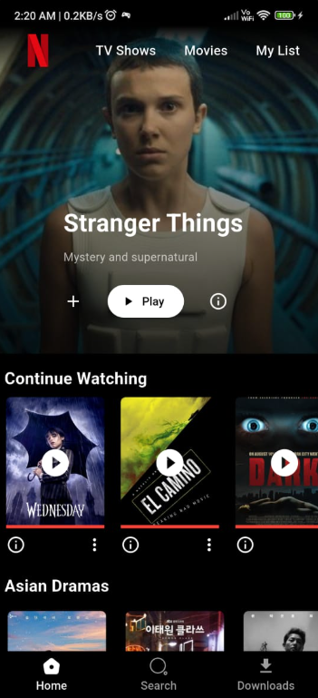
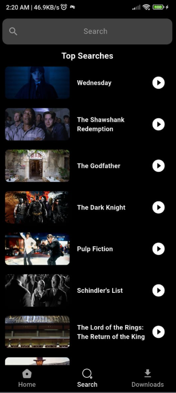
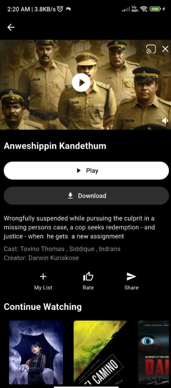

# 🎬 Netflix Clone App

A **Flutter-based Netflix-style streaming UI** that fetches real-time movies and series from an external API.  
The app features dynamic content loading, a structured BLoC architecture, and smooth UI animations to deliver a premium streaming experience.

---

## 🌟 Features

● **Real-time Movie & Series Fetching**  
   Fetches trending, popular, and top-rated movies using live APIs with efficient JSON parsing.

● **Clean BLoC Architecture**  
   Uses BLoC for predictable, scalable, and testable state management.

● **Category-wise Content Browsing**  
   Movies and shows are organized into multiple sections, similar to Netflix UI.

● **Interactive UI/UX**  
   Scrollable movie rows, posters, banners, and smooth transitions for a real OTT feel.

---

## 🛠️ Technology Stack

- **Flutter**
- **Dart**
- **BLoC (Business Logic Component)**
- **HTTP package**
- **JSON Parsing**
- **youtube_player_flutter**

---

## 🗺️ Screenshots

  
  
  

---